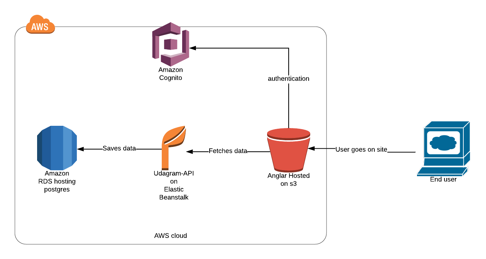

## Udagram Infrastructure

# AWS

#### RDS database

Database endpoint: `udagram.clsvtjrvcngu.us-east-1.rds.amazonaws.com`

#### Elastic Beanstalk

server is running on EBS depending on the database

server url : `http://udagram-api-env.eba-bquwmx92.us-east-1.elasticbeanstalk.com/`

#### S3

front end is uploaded on S3 for static web hosting,
app url : `http://udagram-bucket007.s3-website-us-east-1.amazonaws.com/`
